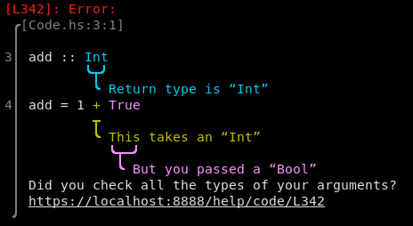

# Chapelure [![CI-badge][CI-badge]][CI-url] ![simple-haskell][simple-haskell]

⚠  The 0.0.\* series is experimental.

## Description

`chapelure` is a diagnostic library for Haskell, based on the [`miette`][miette] library by [Kat Marchán][kat's twitter]

## Build

```bash
$ cabal build 
```


## Examples

You can provide snippets to be annotated and highlighted:

```
[L342]: Error: 
 ╭[Code.hs:3:1] 
 │ 
3│ add :: Int
 │        ╰┬╯
 │         ╰ Return type is an “Int”
4│ add = 1 + True
 │           ╰┬─╯
 │            ╰ You tried to pass a “Bool”
 │ Did you check all the types of your arguments?
 │ https://localhost:8888/help/code/L342
 ╯ 
```

And you can even put multiple highlights per line:

```
[L342]: Error: 
 ╭[Code.hs:3:1] 
 │ 
3│ add :: Int
 │        ╰┬╯
 │         ╰ Return type is “Int”
4│ add = 1 + True
 │         ┬
 │         ╰ This takes an “Int”
 │           ╰┬─╯
 │            ╰ But you passed a “Bool”
 │ Did you check all the types of your arguments?
 │ https://localhost:8888/help/code/L342
 ╯ 
```

To generate such a diagnostic, build the appropriate structures and pass it to the renderer:

```haskell
import Data.Vector.NonEmpty as NEVec
import Chapelure.Types


let helpMessage = "Did you check all the types of your arguments?"
let highlights = NEVec.fromList [
           Source{ label = Just "Return type is “Int”"
                 , line = Line 3
                 , startColumn = Column 8
                 , endColumn = Column 10
                 }
         , Source{ label = Just "This takes an “Int”"
                 , line = Line 4
                 , startColumn = Column 9
                 , endColumn = Column 9
                 }
         , Source{ label = Just "But you passed a “Bool”"
                 , line = Line 4
                 , startColumn = Column 11
                 , endColumn = Column 14
                 }
        ]
let snip = Snippet { location = ("Code.hs", Line 3, Column 1)
                   , highlights = highlights
                   , content = Vec.fromList $ T.lines $ T.pack "add :: Int\nadd = 1 + True"
                   }
let diagnostic = Diagnostic { code = Just "L342"
                            , severity = Error
                            , link = Just "https://localhost:8888/help/code/L342"
                            , help = Just helpMessage
                            , snippets = Just . NEVec.singleton $ snip
                            }
```

It even outputs in colour!



## Acknowledgements

* Kat Marchán
* Geoffroy Couprie

[simple-haskell]: https://img.shields.io/badge/Simple-Haskell-purple?style=flat-square
[miette]: https://github.com/zkat/miette
[kat's twitter]: https://twitter.com/zkat__
[CI-badge]: https://img.shields.io/github/workflow/status/haskell-chapelure/chapelure/CI?style=flat-square
[CI-url]: https://github.com/haskell-chapelure/chapelure/actions
